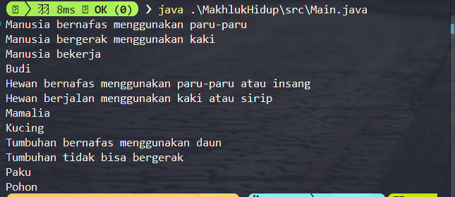

# **Tugas Week 13 PBO**

**Nama** : Adyuta Prajahita Murdianto

**NRP** : 5025221186

**Kelas** : PBO A

# **Makhluk Hidup**

## **Kelas MakhlukHidup**

```java
public abstract class MakhlukHidup {
  private String nama;

  public MakhlukHidup(String nama) {
    this.nama = nama;
  }

  public void bernafas() {
    System.out.println("Makhluk hidup bernafas");
  }

  public void berjalan() {
    System.out.println("Tidak semua makhluk hidup bisa berjalan");
  }

  public String getNama() {
    return nama;
  }
}
```

Merupakan kelas `abstrak` yang berfungsi sebagai kerangka dasar bagi semua kelas turunan yang merepresentasikan makhluk hidup. Kelas ini mendefinisikan atribut umum dan perilaku dasar yang dimiliki semua makhluk hidup, seperti `bernapas` dan `berjalan`, yang dapat diubah oleh kelas turunannya.

### **Atribut**

- **nama**

  Atribut ini digunakan untuk menyimpan `nama` makhluk hidup, yang dapat berupa nama spesifik (untuk manusia) atau nama umum (untuk hewan dan tumbuhan).

### **Metode**

- **MakhlukHidup**

  Konstruktor ini bertanggung jawab untuk menginisialisasi atribut `nama` dengan nilai yang diberikan saat objek dibuat.

- **bernafas**

  Metode ini menampilkan pesan `"Makhluk hidup bernafas"` untuk menggambarkan kemampuan umum semua makhluk hidup dalam melakukan pernapasan. Metode ini dapat diubah oleh kelas turunannya.

- **berjalan**

  Metode ini memberikan pesan bahwa tidak semua makhluk hidup bisa `berjalan`. Ini adalah implementasi dasar yang akan diubah pada kelas turunan sesuai dengan kebutuhan spesifik mereka.

- **getNama**

  Metode ini mengembalikan nilai dari atribut `nama`. Berguna untuk mendapatkan nama makhluk hidup saat diperlukan.

## **Kelas Manusia**

```java
public class Manusia extends MakhlukHidup {
  private String pekerjaan;

  public Manusia(String nama, String pekerjaan) {
    super(nama);
    this.pekerjaan = pekerjaan;
  }

  @Override
  public void bernafas() {
    System.out.println("Manusia bernafas menggunakan paru-paru");
  }

  @Override
  public void berjalan() {
    System.out.println("Manusia bergerak menggunakan kaki");
  }

  public void bekerja() {
    System.out.println("Manusia bekerja");
  }

  public String getPekerjaan() {
    return pekerjaan;
  }
}
```

Kelas ini mewakili `manusia` sebagai salah satu jenis makhluk hidup. Selain mewarisi perilaku dasar dari `MakhlukHidup`, kelas ini menambahkan atribut dan metode khusus yang mencerminkan sifat unik manusia, seperti kemampuan untuk bekerja.

### **Atribut**

- **pekerjaan**

  Atribut ini digunakan untuk menyimpan `pekerjaan` manusia. Pekerjaan ini bisa berupa profesi atau aktivitas utama yang dilakukan manusia dalam kesehariannya.

### **Metode**

- **Manusia**

  Konstruktor ini memanggil konstruktor kelas induk untuk mengatur nama manusia, sekaligus menginisialisasi atribut `pekerjaan` dengan nilai yang diberikan.

- **bernafas**

  Metode ini `meng-override` implementasi dari kelas induk untuk menampilkan pesan spesifik bahwa manusia `bernafas` menggunakan paru-paru, menggambarkan ciri biologis manusia.

- **berjalan**

  Metode ini `meng-override` implementasi dari kelas induk untuk menampilkan pesan spesifik bahwa manusia `bergerak` menggunakan kaki, yang merupakan cara manusia berpindah tempat secara umum.


- **bekerja**

  Metode ini menampilkan pesan bahwa manusia `bekerja`. Ini menunjukkan perilaku unik manusia yang tidak dimiliki oleh makhluk hidup lainnya.

- **getPekerjaan**

  Metode ini mengembalikan nilai atribut `pekerjaan`, sehingga informasi pekerjaan manusia dapat diakses.

## **Kelas Hewan**

```java
public class Hewan extends MakhlukHidup {
  private String jenis;

  public Hewan(String nama, String jenis) {
    super(nama);
    this.jenis = jenis;
  }

  @Override
  public void bernafas() {
    System.out.println("Hewan bernafas menggunakan paru-paru atau insang");
  }

  @Override
  public void berjalan() {
    System.out.println("Hewan berjalan menggunakan kaki atau sirip");
  }

  public String getJenis() {
    return jenis;
  }

}
```

Kelas ini mewakili `hewan` sebagai salah satu jenis makhluk hidup. Kelas ini memiliki atribut dan metode tambahan yang mencerminkan ciri khas hewan, seperti jenis hewan dan cara bergeraknya.

### **Atribut**

- **jenis**

  Atribut ini menyimpan `jenis` hewan, misalnya "Mamalia", "Amfibi", atau "Reptil". Atribut ini membantu mengelompokkan hewan berdasarkan karakteristiknya.

### **Metode**

- **Hewan**

  Konstruktor ini memanggil konstruktor kelas induk untuk mengatur nama hewan, sekaligus menginisialisasi atribut `jenis` dengan nilai yang diberikan.

- **bernafas**

  Metode ini `meng-override` implementasi dari kelas induk untuk menampilkan pesan spesifik bahwa hewan `bernafas` menggunakan paru-paru atau insang, mencerminkan variasi mekanisme pernapasan pada hewan berdasarkan jenisnya.

- **berjalan**

  Metode ini `meng-override` implementasi dari kelas induk untuk menampilkan pesan spesifik bahwa hewan `berjalan` menggunakan kaki atau sirip, menggambarkan beragam cara hewan bergerak di habitatnya.

- **getJenis**

  Metode ini mengembalikan nilai atribut `jenis`, yang memungkinkan informasi tentang kategori hewan dapat diakses.


## **Kelas Tumbuhan**

```java
public class Tumbuhan extends MakhlukHidup {
  private String jenis;

  public Tumbuhan(String nama, String jenis) {
    super(nama);
    this.jenis = jenis;
  }

  @Override
  public void bernafas() {
    System.out.println("Tumbuhan bernafas menggunakan daun");
  }

  @Override
  public void berjalan() {
    System.out.println("Tumbuhan tidak bisa bergerak");
  }

  public String getJenis() {
    return jenis;
  }
}
```

Kelas ini mewakili `tumbuhan` sebagai salah satu jenis makhluk hidup. Kelas ini memiliki atribut dan metode khusus yang mencerminkan sifat unik tumbuhan, seperti jenis tumbuhan dan cara mereka bernafas.

### **Atribut**

- **jenis**

  Atribut ini menyimpan `jenis` tumbuhan, seperti "Berbiji" atau "Paku-pakuan". Informasi ini membantu dalam mengklasifikasikan tumbuhan berdasarkan jenisnya.

### **Metode**

- **Tumbuhan**

  Konstruktor ini memanggil konstruktor kelas induk untuk mengatur nama tumbuhan, sekaligus menginisialisasi atribut `jenis` dengan nilai yang diberikan.

- **bernafas**

  Metode ini `meng-override` implementasi dari kelas induk untuk menampilkan pesan spesifik bahwa tumbuhan `bernafas` menggunakan daun, menggambarkan proses respirasi dan fotosintesis yang menjadi ciri khas tumbuhan.

- **berjalan**

  Metode ini `meng-override` implementasi dari kelas induk untuk menampilkan pesan spesifik bahwa tumbuhan tidak bisa `bergerak`, mencerminkan sifat statis tumbuhan dibandingkan makhluk hidup lainnya.

- **getJenis**

  Metode ini mengembalikan nilai atribut `jenis`, sehingga informasi jenis tumbuhan dapat diakses.

## **Kelas Main**

```java
public class Main {
    public static void main(String[] args) throws Exception {
        Manusia manusia = new Manusia("Budi", "Dokter");
        Hewan hewan = new Hewan("Kucing", "Mamalia");
        Tumbuhan tumbuhan = new Tumbuhan("Pohon", "Paku");

        manusia.bernafas();
        manusia.berjalan();
        manusia.bekerja();
        manusia.getPekerjaan();
        System.out.println(manusia.getNama());

        hewan.bernafas();
        hewan.berjalan();
        System.out.println(hewan.getJenis());
        System.out.println(hewan.getNama());

        tumbuhan.bernafas();
        tumbuhan.berjalan();
        System.out.println(tumbuhan.getJenis());
        System.out.println(tumbuhan.getNama());
    }
}

```
Kelas utama untuk menjalankan program, yang dimana akan menginstansiasi objek dari kelas `Manusia`, `Hewan`, dan `Tumbuhan` untuk mendemonstrasikan penggunaan `abstract class`.

## **Hasil**

