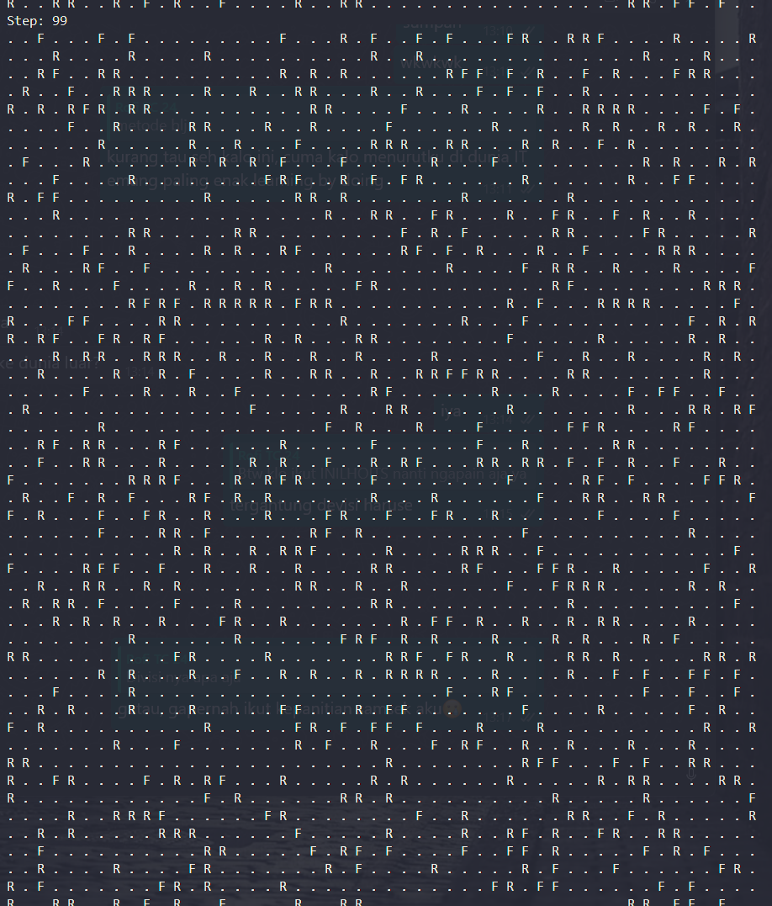

# **Tugas Week 13 PBO**

**Nama** : Adyuta Prajahita Murdianto

**NRP** : 5025221186

**Kelas** : PBO A

# **Makhluk Hidup**

## **Kelas MakhlukHidup**

```java
public abstract class MakhlukHidup {
  private String nama;

  public MakhlukHidup(String nama) {
    this.nama = nama;
  }

  public void bernafas() {
    System.out.println("Makhluk hidup bernafas");
  }

  public void berjalan() {
    System.out.println("Tidak semua makhluk hidup bisa berjalan");
  }

  public String getNama() {
    return nama;
  }
}
```

Merupakan kelas `abstrak` yang berfungsi sebagai kerangka dasar bagi semua kelas turunan yang merepresentasikan makhluk hidup. Kelas ini mendefinisikan atribut umum dan perilaku dasar yang dimiliki semua makhluk hidup, seperti `bernapas` dan `berjalan`, yang dapat diubah oleh kelas turunannya.

### **Atribut**

- **nama**

  Atribut ini digunakan untuk menyimpan `nama` makhluk hidup, yang dapat berupa nama spesifik (untuk manusia) atau nama umum (untuk hewan dan tumbuhan).

### **Metode**

- **MakhlukHidup**

  Konstruktor ini bertanggung jawab untuk menginisialisasi atribut `nama` dengan nilai yang diberikan saat objek dibuat.

- **bernafas**

  Metode ini menampilkan pesan `"Makhluk hidup bernafas"` untuk menggambarkan kemampuan umum semua makhluk hidup dalam melakukan pernapasan. Metode ini dapat diubah oleh kelas turunannya.

- **berjalan**

  Metode ini memberikan pesan bahwa tidak semua makhluk hidup bisa `berjalan`. Ini adalah implementasi dasar yang akan diubah pada kelas turunan sesuai dengan kebutuhan spesifik mereka.

- **getNama**

  Metode ini mengembalikan nilai dari atribut `nama`. Berguna untuk mendapatkan nama makhluk hidup saat diperlukan.

## **Kelas Manusia**

```java
public class Manusia extends MakhlukHidup {
  private String pekerjaan;

  public Manusia(String nama, String pekerjaan) {
    super(nama);
    this.pekerjaan = pekerjaan;
  }

  @Override
  public void bernafas() {
    System.out.println("Manusia bernafas menggunakan paru-paru");
  }

  @Override
  public void berjalan() {
    System.out.println("Manusia bergerak menggunakan kaki");
  }

  public void bekerja() {
    System.out.println("Manusia bekerja");
  }

  public String getPekerjaan() {
    return pekerjaan;
  }
}
```

Kelas ini mewakili `manusia` sebagai salah satu jenis makhluk hidup. Selain mewarisi perilaku dasar dari `MakhlukHidup`, kelas ini menambahkan atribut dan metode khusus yang mencerminkan sifat unik manusia, seperti kemampuan untuk bekerja.

### **Atribut**

- **pekerjaan**

  Atribut ini digunakan untuk menyimpan `pekerjaan` manusia. Pekerjaan ini bisa berupa profesi atau aktivitas utama yang dilakukan manusia dalam kesehariannya.

### **Metode**

- **Manusia**

  Konstruktor ini memanggil konstruktor kelas induk untuk mengatur nama manusia, sekaligus menginisialisasi atribut `pekerjaan` dengan nilai yang diberikan.

- **bernafas**

  Metode ini `meng-override` implementasi dari kelas induk untuk menampilkan pesan spesifik bahwa manusia `bernafas` menggunakan paru-paru, menggambarkan ciri biologis manusia.

- **berjalan**

  Metode ini `meng-override` implementasi dari kelas induk untuk menampilkan pesan spesifik bahwa manusia `bergerak` menggunakan kaki, yang merupakan cara manusia berpindah tempat secara umum.


- **bekerja**

  Metode ini menampilkan pesan bahwa manusia `bekerja`. Ini menunjukkan perilaku unik manusia yang tidak dimiliki oleh makhluk hidup lainnya.

- **getPekerjaan**

  Metode ini mengembalikan nilai atribut `pekerjaan`, sehingga informasi pekerjaan manusia dapat diakses.

## **Kelas Hewan**

```java
public class Hewan extends MakhlukHidup {
  private String jenis;

  public Hewan(String nama, String jenis) {
    super(nama);
    this.jenis = jenis;
  }

  @Override
  public void bernafas() {
    System.out.println("Hewan bernafas menggunakan paru-paru atau insang");
  }

  @Override
  public void berjalan() {
    System.out.println("Hewan berjalan menggunakan kaki atau sirip");
  }

  public String getJenis() {
    return jenis;
  }

}
```

Kelas ini mewakili `hewan` sebagai salah satu jenis makhluk hidup. Kelas ini memiliki atribut dan metode tambahan yang mencerminkan ciri khas hewan, seperti jenis hewan dan cara bergeraknya.

### **Atribut**

- **jenis**

  Atribut ini menyimpan `jenis` hewan, misalnya "Mamalia", "Amfibi", atau "Reptil". Atribut ini membantu mengelompokkan hewan berdasarkan karakteristiknya.

### **Metode**

- **Hewan**

  Konstruktor ini memanggil konstruktor kelas induk untuk mengatur nama hewan, sekaligus menginisialisasi atribut `jenis` dengan nilai yang diberikan.

- **bernafas**

  Metode ini `meng-override` implementasi dari kelas induk untuk menampilkan pesan spesifik bahwa hewan `bernafas` menggunakan paru-paru atau insang, mencerminkan variasi mekanisme pernapasan pada hewan berdasarkan jenisnya.

- **berjalan**

  Metode ini `meng-override` implementasi dari kelas induk untuk menampilkan pesan spesifik bahwa hewan `berjalan` menggunakan kaki atau sirip, menggambarkan beragam cara hewan bergerak di habitatnya.

- **getJenis**

  Metode ini mengembalikan nilai atribut `jenis`, yang memungkinkan informasi tentang kategori hewan dapat diakses.


## **Kelas Tumbuhan**

```java
public class Tumbuhan extends MakhlukHidup {
  private String jenis;

  public Tumbuhan(String nama, String jenis) {
    super(nama);
    this.jenis = jenis;
  }

  @Override
  public void bernafas() {
    System.out.println("Tumbuhan bernafas menggunakan daun");
  }

  @Override
  public void berjalan() {
    System.out.println("Tumbuhan tidak bisa bergerak");
  }

  public String getJenis() {
    return jenis;
  }
}
```

Kelas ini mewakili `tumbuhan` sebagai salah satu jenis makhluk hidup. Kelas ini memiliki atribut dan metode khusus yang mencerminkan sifat unik tumbuhan, seperti jenis tumbuhan dan cara mereka bernafas.

### **Atribut**

- **jenis**

  Atribut ini menyimpan `jenis` tumbuhan, seperti "Berbiji" atau "Paku-pakuan". Informasi ini membantu dalam mengklasifikasikan tumbuhan berdasarkan jenisnya.

### **Metode**

- **Tumbuhan**

  Konstruktor ini memanggil konstruktor kelas induk untuk mengatur nama tumbuhan, sekaligus menginisialisasi atribut `jenis` dengan nilai yang diberikan.

- **bernafas**

  Metode ini `meng-override` implementasi dari kelas induk untuk menampilkan pesan spesifik bahwa tumbuhan `bernafas` menggunakan daun, menggambarkan proses respirasi dan fotosintesis yang menjadi ciri khas tumbuhan.

- **berjalan**

  Metode ini `meng-override` implementasi dari kelas induk untuk menampilkan pesan spesifik bahwa tumbuhan tidak bisa `bergerak`, mencerminkan sifat statis tumbuhan dibandingkan makhluk hidup lainnya.

- **getJenis**

  Metode ini mengembalikan nilai atribut `jenis`, sehingga informasi jenis tumbuhan dapat diakses.

## **Kelas Main**

```java
public class Main {
    public static void main(String[] args) throws Exception {
        Manusia manusia = new Manusia("Budi", "Dokter");
        Hewan hewan = new Hewan("Kucing", "Mamalia");
        Tumbuhan tumbuhan = new Tumbuhan("Pohon", "Paku");

        manusia.bernafas();
        manusia.berjalan();
        manusia.bekerja();
        manusia.getPekerjaan();
        System.out.println(manusia.getNama());

        hewan.bernafas();
        hewan.berjalan();
        System.out.println(hewan.getJenis());
        System.out.println(hewan.getNama());

        tumbuhan.bernafas();
        tumbuhan.berjalan();
        System.out.println(tumbuhan.getJenis());
        System.out.println(tumbuhan.getNama());
    }
}

```
Kelas utama untuk menjalankan program, yang dimana akan menginstansiasi objek dari kelas `Manusia`, `Hewan`, dan `Tumbuhan` untuk mendemonstrasikan penggunaan `abstract class`.

## **Hasil**


# **Fox and Rabbit**

## **Kelas Animal**

```java
import java.util.List;

public abstract class Animal {
  protected Field field;
  protected Location location;
  protected boolean alive;

  public Animal(Field field, Location location) {
    this.field = field;
    this.location = location;
    alive = true;
    field.place(this, location);
  }

  public abstract void act(List<Animal> newAnimals);

  public boolean isAlive() {
    return alive;
  }

  public void setDead() {
    alive = false;
    field.place(null, location);
  }

  public Location getLocation() {
    return location;
  }
}
```

Kelas abstrak yang merepresentasikan makhluk hidup dalam simulasi. `Animal` menyediakan atribut dan metode dasar untuk semua jenis hewan seperti status hidup, lokasi, dan perilaku umum.

### **Atribut**

- **field**

  Menyimpan referensi ke objek `Field`, yaitu area simulasi tempat hewan dapat bergerak dan berinteraksi dengan objek lain.

- **location**

  Menyimpan posisi hewan di grid `Field`. Lokasi ini dinyatakan dalam koordinat (baris dan kolom) yang digunakan untuk melacak posisi setiap hewan.

- **alive**

  Menyimpan status hidup atau mati dari hewan. Jika hewan mati, status ini akan diubah menjadi `false`, dan hewan dihapus dari area simulasi.

### **Metode**

- **Animal**

  Menginisialisasi hewan dengan referensi ke `Field` dan lokasi awal di dalamnya. Hewan tersebut langsung ditempatkan di lokasi yang ditentukan pada grid `Field`.

- **act**

  Metode abstrak yang harus diimplementasikan oleh kelas turunan. Metode ini mendefinisikan perilaku spesifik setiap jenis hewan, seperti berburu, bergerak, atau bereproduksi.

- **isAlive**

  Mengembalikan nilai `alive` untuk memeriksa apakah hewan masih hidup. Digunakan oleh simulasi untuk menentukan apakah hewan tersebut perlu dihapus atau tetap dilibatkan dalam simulasi.

- **setDead**

  Mengubah status `alive` menjadi `false`, yang berarti hewan telah mati. Selain itu, metode ini juga menghapus referensi hewan dari lokasi pada grid Field.

- **getLocation**

  Mengembalikan lokasi saat ini dari hewan di grid. Lokasi ini digunakan untuk melacak dan mengupdate posisi hewan selama simulasi.

## **Kelas Field**

```java
public class Field {
  private Object[][] field;

  public Field(int depth, int width) {
    field = new Object[depth][width];
  }

  public int getDepth() {
    return field.length;
  }

  public int getWidth() {
    return field[0].length;
  }

  public void place(Object object, Location location) {
    field[location.getRow()][location.getCol()] = object;
  }

  public Object getObjectAt(Location location) {
    return field[location.getRow()][location.getCol()];
  }

  public void clear() {
    for (int row = 0; row < field.length; row++) {
      for (int col = 0; col < field[row].length; col++) {
        field[row][col] = null;
      }
    }
  }
}
```

Kelas `Field` digunakan untuk merepresentasikan area simulasi berbentuk grid dua dimensi. Grid ini bertindak sebagai ruang tempat hewan-hewan bergerak, berinteraksi, dan hidup. Kelas ini bertanggung jawab mengelola penempatan objek (hewan) di grid dan menyediakan metode untuk mendapatkan informasi tentang isi grid pada lokasi tertentu.

### **Atribut**

- **field** 

  Matriks dua dimensi `(Object[][])` yang menyimpan referensi ke objek yang ada di dalam grid. Objek ini bisa berupa `Fox`, `Rabbit`, atau `null` jika lokasi kosong.

### **Metode**

- **Field** 

  Membuat grid dua dimensi dengan ukuran tertentu (`depth` untuk jumlah baris dan `width` untuk jumlah kolom). Matriks diinisialisasi dengan nilai `null`, yang berarti semua lokasi awalnya kosong.

- **getDepth** 

  Mengembalikan jumlah baris `(kedalaman)` dari grid simulasi.

- **getWidth** 

  Mengembalikan jumlah kolom `(lebar)` dari grid simulasi.

- **place** 

  Menempatkan objek tertentu pada lokasi spesifik di grid. Objek ini menggantikan apa pun yang ada di lokasi tersebut, termasuk `null` jika lokasinya kosong.

- **getObjectAt** 

  Mengembalikan referensi ke objek yang berada pada lokasi tertentu di grid. Digunakan untuk memeriksa isi lokasi, seperti apakah ada rubah, kelinci, atau lokasi tersebut kosong.

- **clear** 

  Mengosongkan grid dengan mengisi semua lokasi di matriks dengan `null`. Ini digunakan untuk mereset area simulasi.

## **Kelas Fox**

```java
import java.util.List;

public class Fox extends Animal {
  public Fox(Field field, Location location) {
    super(field, location);
  }

  @Override
  public void act(List<Animal> newAnimals) {
    // Add behavior: hunt rabbits, reproduce, etc.
  }
}
```

Kelas ini merepresentasikan `rubah` sebagai predator dalam simulasi. Rubah memiliki perilaku khas, seperti berburu kelinci, bergerak untuk mencari makanan, dan bereproduksi. Kelas ini merupakan turunan dari kelas `Animal` dan memanfaatkan metode serta atribut dasar yang didefinisikan di kelas induknya.

### **Metode**

- **Fox**

  Memanggil konstruktor superclass `Animal` untuk menginisialisasi rubah dengan referensi ke `Field` dan lokasi awal di grid simulasi. Lokasi rubah langsung ditempatkan pada grid.

- **act**

  Metode ini `meng-override` metode abstrak act dari kelas `Animal` untuk mendefinisikan perilaku rubah.

## **Kelas Location**

```java
public class Location {
  private int row;
  private int col;

  public Location(int row, int col) {
    this.row = row;
    this.col = col;
  }

  public int getRow() {
    return row;
  }

  public int getCol() {
    return col;
  }

  public boolean equals(Object obj) {
    if (obj instanceof Location) {
      Location other = (Location) obj;
      return row == other.getRow() && col == other.getCol();
    }
    return false;
  }
}
```

Kelas ini merepresentasikan posisi suatu objek dalam grid simulasi. Posisi ditentukan oleh koordinat berupa baris `(row)` dan kolom `(col)`. Objek `Location` digunakan untuk melacak lokasi hewan atau objek lain di dalam grid simulasi `(Field)`.

### **Atribut**

- **row**

  Menyimpan informasi baris lokasi dalam grid. Baris adalah indeks vertikal dalam grid simulasi.

- **col**

  Menyimpan informasi kolom lokasi dalam grid. Kolom adalah indeks horizontal dalam grid simulasi.

### **Metode**

- **Location**

  Konstruktor ini digunakan untuk membuat objek `Location` baru dengan nilai baris dan kolom tertentu. Parameter `row` dan `col` diinisialisasi untuk merepresentasikan koordinat lokasi dalam grid simulasi.

- **getRow**

  Metode ini digunakan untuk mengembalikan nilai atribut `row`, yaitu indeks baris dari lokasi saat ini. Dengan metode ini, program dapat mengetahui posisi vertikal suatu objek di grid.

- **getCol**

  Metode ini digunakan untuk mengembalikan nilai atribut `col`, yaitu indeks kolom dari lokasi saat ini. Metode ini memungkinkan program mengetahui posisi horizontal suatu objek di grid.

- **equals**

  Metode ini `meng-override` fungsi `equals` bawaan Java untuk membandingkan dua objek `Location`. Jika objek lain juga merupakan instance dari `Location`, maka metode ini memeriksa apakah nilai `row` dan `col` kedua lokasi sama. Metode ini berguna untuk memeriksa apakah dua objek (seperti rubah dan kelinci) berada di lokasi yang sama dalam grid.

## **Kelas Rabbit**

```java
import java.util.List;

public class Rabbit extends Animal {
  public Rabbit(Field field, Location location) {
    super(field, location);
  }

  @Override
  public void act(List<Animal> newAnimals) {
    // Add behavior: move randomly, reproduce, etc.
  }
}
```

Kelas ini merepresentasikan `kelinci` sebagai mangsa dalam simulasi. Kelinci memiliki perilaku khas, seperti berpindah tempat secara acak untuk menghindari predator, serta bereproduksi untuk menjaga populasinya. Kelas ini merupakan turunan dari `Animal` dan memanfaatkan metode serta atribut dasar yang didefinisikan di kelas induknya.

### **Metode**

- **Rabbit**

  Memanggil konstruktor superclass `Animal` untuk menginisialisasi kelinci dengan referensi ke `Field` dan lokasi awal di grid simulasi.

- **act**

  Metode ini `meng-override` metode abstrak `act` dari kelas `Animal` untuk mendefinisikan perilaku kelinci.

## **Kelas Randomizer**

```java
import java.util.Random;

public class Randomizer {
  private static Random random = new Random();

  public static Random getRandom() {
    return random;
  }
}
```

Kelas `Randomizer` menyediakan generator angka acak yang digunakan dalam simulasi, seperti menentukan apakah hewan (rubah atau kelinci) muncul di lokasi tertentu atau mengacak pergerakan mereka. Kelas ini memastikan bahwa generator angka acak dapat diakses secara konsisten di seluruh program melalui metode statis.

### **Atribut**

- **random**

  Atribut ini adalah instance dari kelas `Random` yang digunakan untuk menghasilkan angka acak. Atribut ini bersifat `static`, sehingga hanya ada satu instance generator angka acak yang dibagikan di seluruh program, memastikan konsistensi hasil acak dalam simulasi.

### **Metode**

- **getRandom**

  Metode ini adalah metode statis yang mengembalikan instance generator angka acak `(random)`. Dengan metode ini, kelas lain dapat menggunakan generator angka acak tanpa perlu membuat instance baru dari `Random`, sehingga meningkatkan efisiensi dan kemudahan akses dalam program.

## **Kelas Simulator**

```java
import java.util.List;
import java.util.ArrayList;

public class Simulator {
  private Field field;
  private SimulatorView view;
  private List<Animal> animals;

  public Simulator(int width, int height) {
    field = new Field(width, height);
    view = new SimulatorView(field);
    animals = new ArrayList<>();
    populate();
  }

  public void simulate(int steps) {
    for (int step = 0; step < steps; step++) {
      List<Animal> newAnimals = new ArrayList<>();
      for (Animal animal : animals) {
        animal.act(newAnimals);
      }
      animals.addAll(newAnimals);
      view.showStatus(step, field);
    }
  }

  private void populate() {
    for (int row = 0; row < field.getDepth(); row++) {
      for (int col = 0; col < field.getWidth(); col++) {
        if (Randomizer.getRandom().nextDouble() <= 0.08) {
          Fox fox = new Fox(field, new Location(row, col));
          animals.add(fox);
        } else if (Randomizer.getRandom().nextDouble() <= 0.2) {
          Rabbit rabbit = new Rabbit(field, new Location(row, col));
          animals.add(rabbit);
        }
      }
    }
  }

  public static void main(String[] args) {
    Simulator simulator = new Simulator(50, 50);
    simulator.simulate(100);
  }
}
```

Bertanggung jawab untuk mengelola jalannya simulasi, termasuk inisialisasi area simulasi `(Field)`, pembuatan daftar hewan `(Animal)`, dan menjalankan simulasi langkah demi langkah. Kelas ini juga bertugas menampilkan status simulasi pada setiap langkah melalui SimulatorView. Dengan mengatur semua komponen ini, `Simulator` menjadi inti dari eksekusi simulasi.

### **Atribut**

- **field**

  Atribut ini adalah objek `Field` yang merepresentasikan area simulasi berbentuk grid. Grid ini menjadi tempat semua interaksi antara rubah, kelinci, dan elemen lainnya dalam simulasi.

- **view**

  Atribut ini adalah objek `SimulatorView` yang digunakan untuk menampilkan status simulasi dalam bentuk visual sederhana berupa grid. Grid menunjukkan lokasi rubah, kelinci, dan area kosong dalam simulasi.

- **animals**

  Atribut ini adalah daftar `(List)` yang menyimpan semua hewan `(Animal)` dalam simulasi. Daftar ini digunakan untuk mengelola perilaku hewan pada setiap langkah simulasi, seperti bergerak, bereproduksi, atau mati.

### **Metode**

- **Simulator**

  Konstruktor ini menginisialisasi area simulasi `(Field)` dengan dimensi tertentu, membuat tampilan simulasi `(SimulatorView)`, dan memulai daftar hewan kosong. Setelah itu, konstruktor memanggil metode `populate` untuk mengisi area simulasi dengan rubah dan kelinci secara acak.

- **simulate**

  Metode ini menjalankan simulasi selama sejumlah langkah yang ditentukan. Pada setiap langkah, metode ini membuat daftar baru untuk menampung hewan yang lahir `(newAnimals)`, menjalankan perilaku `(act)` dari setiap hewan dalam daftar `animals`, dan menambahkan hewan baru ke daftar utama. Setelah itu, status simulasi diperbarui dan ditampilkan menggunakan `view.showStatus`.

- **populate**

  Metode ini bertugas untuk mengisi area simulasi dengan rubah `(Fox)` dan kelinci `(Rabbit)` berdasarkan probabilitas tertentu. Dengan menggunakan generator angka acak dari `Randomizer`, metode ini memutuskan secara acak apakah sebuah lokasi di grid akan dihuni oleh rubah, kelinci, atau tetap kosong.

- **main**

  Metode ini adalah titik masuk utama program. Metode ini membuat objek `Simulator` dengan ukuran area simulasi 50x50 dan menjalankan simulasi selama 100 langkah menggunakan metode `simulate`.

## **Kelas SimulatorView**

```java
public class SimulatorView {
  private Field field;

  public SimulatorView(Field field) {
    this.field = field;
  }

  public void showStatus(int step, Field field) {
    System.out.println("Step: " + step);
    for (int row = 0; row < field.getDepth(); row++) {
      for (int col = 0; col < field.getWidth(); col++) {
        Object obj = field.getObjectAt(new Location(row, col));
        if (obj instanceof Rabbit) {
          System.out.print("R ");
        } else if (obj instanceof Fox) {
          System.out.print("F ");
        } else {
          System.out.print(". ");
        }
      }
      System.out.println();
    }
  }
}
```

Bertanggung jawab untuk menampilkan status simulasi dalam bentuk visual sederhana. Status ditampilkan sebagai grid, di mana setiap lokasi dalam grid merepresentasikan apakah tempat tersebut dihuni oleh rubah `(F)`, kelinci `(R)`, atau kosong `(.)`. Kelas ini memastikan pengguna dapat melihat perkembangan simulasi, termasuk interaksi antara rubah dan kelinci, pada setiap langkah.

### **Atribut**

- **field**

  Atribut ini adalah referensi ke objek `Field` yang digunakan untuk menyimpan area simulasi berbentuk grid. Atribut ini memungkinkan kelas `SimulatorView` untuk mengakses informasi tentang lokasi hewan atau status grid lainnya, yang akan digunakan untuk menampilkan status simulasi.

### **Metode**

- **SimulatorView**

  Konstruktor ini menginisialisasi objek `SimulatorView` dengan referensi ke area simulasi `(Field)`. Referensi ini digunakan untuk membaca status grid, seperti posisi rubah dan kelinci, yang akan ditampilkan dalam simulasi.

- **showStatus**

  Metode ini bertanggung jawab untuk menampilkan status simulasi pada langkah tertentu `(step)`. Metode ini mencetak grid simulasi ke konsol, di mana setiap baris dan kolom merepresentasikan lokasi dalam `Field`.

## **Hasi**

